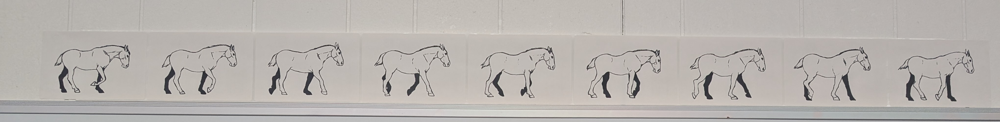

# PDF to ZPL [](https://packagist.org/packages/faerber/pdf-to-zpl) [](https://github.com/benfaerber/pdf-to-zpl/actions)



Convert a PDF into the ZPL format. Allowing for custom images, alphabets like Hebrew, Arabic and Cyrillic (without messing with fonts on the printer) and multipage shipping labels!

## Gettings Started:
```
composer require faerber/pdf-to-zpl
```

```php
<?php
use Faerber\PdfToZpl\PdfToZplConverter;

$converter = new PdfToZplConverter();

// Get an array of ZPL commands (1 per page)
$pages = $converter->convertFromFile("myFile.pdf");
// Or from a blob:
$pages = $converter->convertFromBlob(file_get_contents("myFile.pdf"));

foreach ($pages as $index => $page) {
    // Each page is a single ZPL statement
    assert(str_starts_with($page, "^XA^GFA,"));
}
```

## Environment Setup:

Ensure you have Imagick and GD installed using:
```
sudo apt install php8.4-gd

sudo apt install php8.4-imagick
```
Then make sure to enable them in `php.ini`.


This library can work with only Imagick but GD is recommended because it's a lot faster (see [benchmarks](./.phpbench/html/index.html) for more details)! 
If you would like to only use Imagick use these settings:
```php
<?php

use Faerber\PdfToZpl\PdfToZplConverter;
use Faerber\PdfToZpl\Settings\ConverterSettings;
use Faerber\PdfToZpl\Images\ImageProcessorOption;

$converter = new PdfToZplConverter(
    new ConverterSettings(
        imageProcessorOption: ImageProcessorOption::Imagick,
    )
);
```

### Imagick Settings
You may need to enable PDF permission in your Imagick settings.

The easiest way to do this is by running the setup shell script: `sudo ./scripts/configure-imagick.sh`

If the script doesn't meet your needs you can perform the change manually.
First edit your Imagick Policy file with: `sudo nano "/etc/$(ls /etc/ | grep ImageMagick)/policy.xml"`

Find this line and ensure the rights are set to `read | write`:
```
<policy domain="coder" rights="none" pattern="PDF" />
```
Change to:
```
<policy domain="coder" rights="read | write" pattern="PDF" />
```
If this line doesn't exist at all, add it. You'll only run into this with tiny linux boxes like Github Actions. 


I've only tested this library on Linux and Mac so if you get it working on windows feel free to open a PR!

## Converting Images:
```php
<?php
use Faerber\PdfToZpl\ImageToZplConverter;

$converter = new ImagetoZplConverter();

// Get an array of ZPL commands (1 per page)
[$zpl] = $converter->convertFromFile("myFile.png");
assert(str_starts_with($zpl, "^XA^GFA,"));
```

## Previewing Labels
The [`labelary`](https://labelary.com/) API is used to generate images from ZPL allowing the label to be previewed.
This is a free API that requires no auth so it can be used with no setup. Be sure to respect their rate limits!

```php
<?php
use Faerber\PdfToZpl\LabelImage;
use Faerber\PdfToZpl\Settings\LabelDirection;

$zpl = "^XA_ZPL_DATA_HERE...";

$labelImage = new LabelImage(
    zpl: $zpl,
    direction: LabelDirection::Up,
);
$labelImage->saveAs("my_label.png");
```


## Unit Testing
Testing is done via PHP Unit. Run `composer test`.

If you make major changes you may need to regenerate the test data.
For example modifying scaling code where the output is correct but the test data is outdated.
Run `composer generate-test-data` and manually verify the images are rendered correctly.

## Benchmarking
Benchmarking is done via `phpbench`. Run `composer benchmark`.

## Formatting
Formatting is done via `php-cs-fixer`. Run `composer format`.

## How does this work?
1. Loads the PDF and render each page as image
1. Scale the image to match the DPI and aspect ratio of the label
1. Convert each page into a grayscaled bitmap
1. Run line encode the bitmap and marshall it into a ZPL binary representation
1. Wrap the encoded data into a ZPL payload
